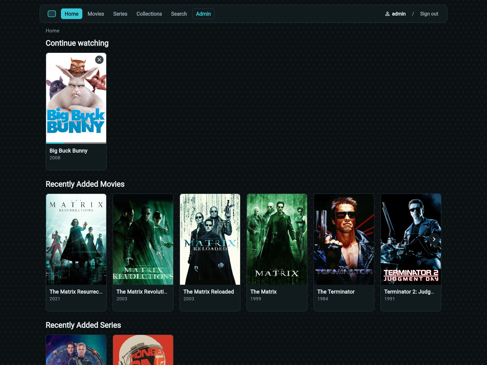
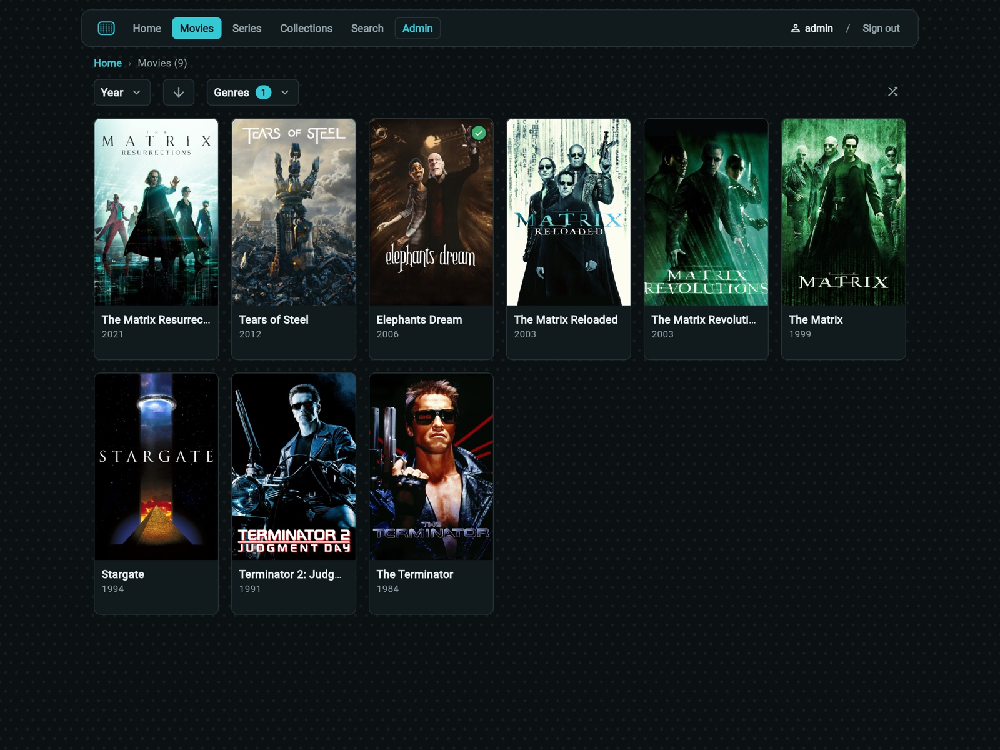
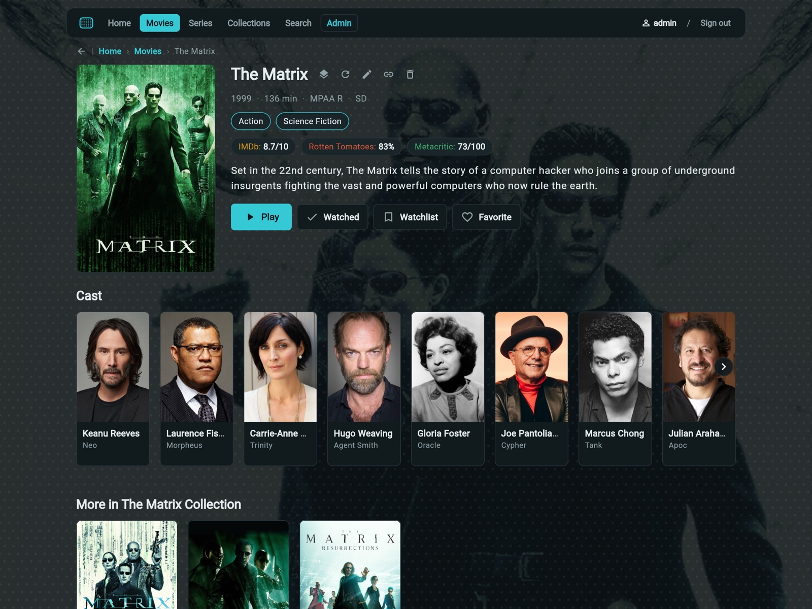
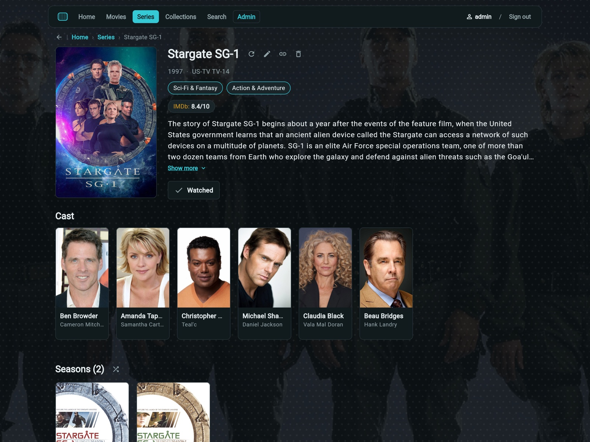
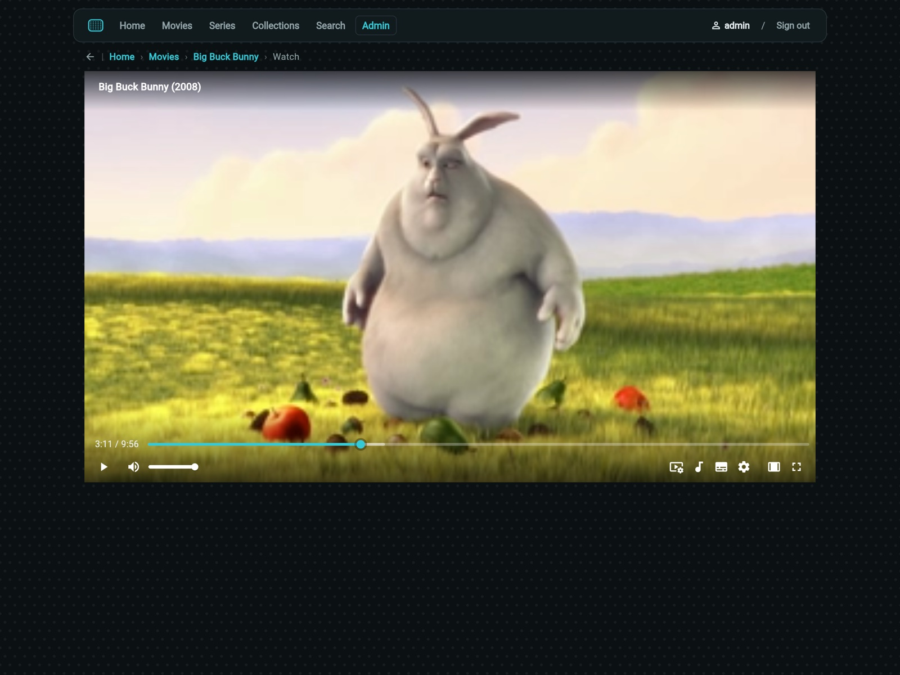
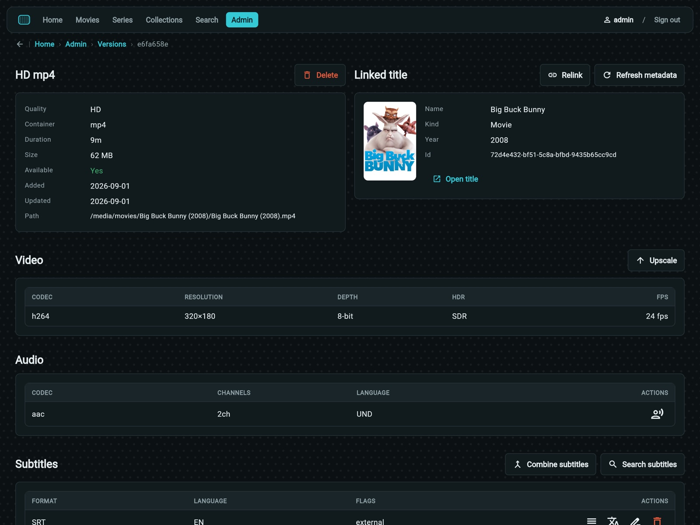
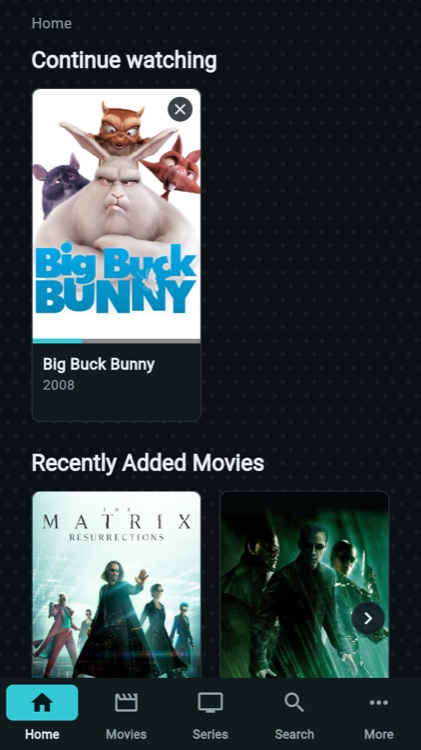
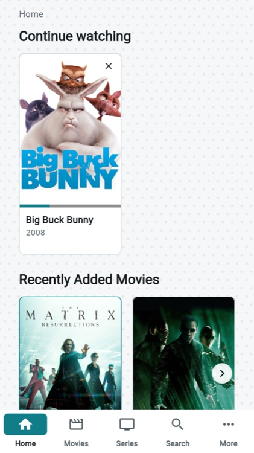
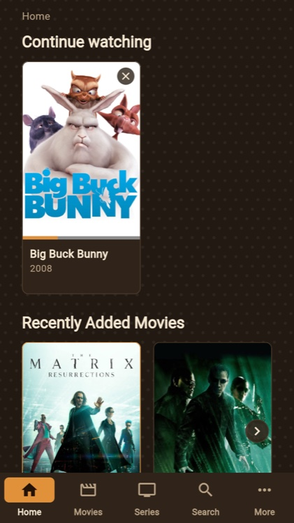

# Shadowmask - Self-Hosted Media Server


Shadowmask is a self-hosted media library and streaming server for movies and series. It scans your
media files, recognizes and organizes them, enriches them with metadata, artwork and subtitles, and
streams to multiple players with per-user accounts and access control.

## Features

**Streaming and playback**

* HLS adaptive streaming, direct play, and remux when the codecs already fit
* Hardware-accelerated transcoding with software fallback, and HDR to SDR tone mapping
* Resume across devices, and a per-user bitrate cap
* Multi-track audio, soft (WebVTT) and burned-in subtitles, plus external subtitle files
* Per-user, per-track subtitle sync offset, and admin-derived bilingual stacked subtitle tracks
* Chapter navigation, trickplay seek thumbnails, and autoplay of the next episode

**Library and metadata**

* Movies, series, seasons, episodes and collections, with automatic recognition and a manual
  resolution queue for what it cannot match
* Metadata from OMDB and TMDB; subtitles from OpenSubtitles
* Poster, backdrop, banner, logo and clearart variants, resized and served per request
* Content ratings as a normalized field, driving parental controls
* Per-library watcher strategies (local events, polling, scheduled, manual), plus duplicate detection

**Discovery**

* Full-text search across titles, people and genres
* Continue watching, next up, and composed home hubs

**Optional**

* Local AI enrichment: transcription and translation, run on your own hardware. See
  [`deployment/ENRICHMENT.md`](deployment/ENRICHMENT.md).
* Remote content fetch through yt-dlp

## Screenshots

| Home                                                                                                          | Movies                                                                                          |
|---------------------------------------------------------------------------------------------------------------|-------------------------------------------------------------------------------------------------|
|  |  |

| Movie details                                                                                                       | Series details                                                                                        |
|---------------------------------------------------------------------------------------------------------------------|-------------------------------------------------------------------------------------------------------|
|  |  |

| Player                                                                                                                          | Version admin                                                                                                                              |
|---------------------------------------------------------------------------------------------------------------------------------|--------------------------------------------------------------------------------------------------------------------------------------------|
|  |  |

On a phone, in each of the three themes:

| Dark                                                                                                  | Light                                                                                                   | Retro                                                                                                   |
|-------------------------------------------------------------------------------------------------------|---------------------------------------------------------------------------------------------------------|---------------------------------------------------------------------------------------------------------|
|  |  |  |

## Quick start

```
git clone https://github.com/sndnv/shadowmask.git
cd shadowmask/deployment/production
cp secrets/templates/shadowmask.env.template secrets/shadowmask.env
```

Fill in `SHADOWMASK_JWT_SECRET` and `SHADOWMASK_STREAM_SECRET` (`openssl rand -hex 32` for each) and
set an admin password, then point the stack at your libraries and at the address browsers will use
to reach it:

```
export SHADOWMASK_MOVIES_DIR=/path/to/movies
export SHADOWMASK_TV_DIR=/path/to/tv
export SHADOWMASK_API_BASE=http://192.168.1.10:8080
export SHADOWMASK_WEB_UI_ORIGIN=http://192.168.1.10:8090
docker compose up -d
```

Both addresses are what the **browser** resolves, so use the host's address rather than `localhost`
unless you only ever browse from the host itself.

The server listens on port 8080 and the web UI on 8090; `/health` reports readiness. See
[`deployment/production/README.md`](deployment/production/README.md) for TLS, bootstrap, hardware
acceleration and the rest.

## Clients

* **Flutter** ([`clients/flutter`](./clients/flutter)) - the primary interface, one codebase covering
  the web, the desktop (macOS and Linux) and mobile (Android and iOS). The web build is published as
  `ghcr.io/sndnv/shadowmask-web-ui`; the desktop ships as a macOS `.dmg` and a Linux `.AppImage`;
  mobile ships as a signed Android `.apk`, and as an unsigned iOS `.ipa` that has to be signed at
  install time with a tool such as Sideloadly or AltStore
* **Roku** ([`clients/roku`](./clients/roku)) - a SceneGraph channel for Roku devices. Viewer-only,
  with no admin surface, and paired by link code so no password is typed on the remote. It ships as
  a channel zip, installed by sideloading
* **Basic** ([`clients/basic`](./clients/basic)) - a dependency-free HTML/JS client served by the
  server itself at `/ui/basic/`, useful as a fallback and for debugging

## Components

A Cargo workspace where every crate depends inward on `domain`:

* [`domain`](./crates/domain) - core entities, traits, and errors; zero infrastructure dependencies
* [`persistence`](./crates/persistence) - SQLite (sqlx) implementations of the repository traits
* [`media`](./crates/media) - FFmpeg/ffprobe, transcoding, HLS, and capability negotiation
* [`metadata`](./crates/metadata) - external metadata and subtitle clients (OMDB, TMDB, OpenSubtitles)
* [`inference`](./crates/inference) - optional local AI enrichment (transcription, translation)
* [`fetch`](./crates/fetch) - optional remote content retrieval via yt-dlp
* [`services`](./crates/services) - business logic for catalog, library, streaming, and users
* [`jobs`](./crates/jobs) - background job queue, workers, and scheduler
* [`api`](./crates/api) - axum HTTP router, handlers, DTOs, and auth/RBAC
* [`server`](./crates/server) - the binary; composition root, config, and bootstrap
* [`mocks`](./crates/mocks) - in-memory trait implementations used by tests
* [`contracts`](./crates/contracts) - shared contract tests every repository implementation must pass

## Development

Refer to the [DEVELOPMENT.md](DEVELOPMENT.md) file for more details.

## Contributing

Contributions are always welcome!

Refer to the [CONTRIBUTING.md](CONTRIBUTING.md) file for more details.

## Security

Refer to the [SECURITY.md](SECURITY.md) file for how to report a vulnerability.

## Privacy

Shadowmask is self-hosted software, not a service: there is no telemetry, no analytics and no
account with us, and every outbound integration is off until an operator turns it on. Refer to the
[PRIVACY.md](PRIVACY.md) file for what is stored and what leaves your server.

## Versioning

We use [SemVer](http://semver.org/) for versioning.

## Third-party content

* The Rust crates linked into the server binary are credited, with their licence texts, in
  [`THIRD-PARTY-LICENSES.md`](./THIRD-PARTY-LICENSES.md). It is generated from `Cargo.lock` by
  [`cargo-about`](https://github.com/EmbarkStudios/cargo-about); `qa.py` fails when it drifts.
* The published server images carry that file, this project's `LICENSE`, and a Debian `copyright`
  file for every packaged dependency.
  [`deployment/SERVER-IMAGE-CREDITS.md`](./deployment/SERVER-IMAGE-CREDITS.md) lists where each sits
  inside the image, and why the GPL-2+ FFmpeg they install stays separate from Shadowmask's code.
* [hls.js](https://github.com/video-dev/hls.js) is bundled by both web clients for HLS playback,
  under the Apache License 2.0. Its bundle inlines `url-toolkit` (Apache-2.0) and `eventemitter3`
  (MIT); all three notices are in
  [`assets/vendor/hls.js.LICENSE.txt`](./assets/vendor/hls.js.LICENSE.txt), distributed alongside
  the script.
* [Roboto](https://github.com/googlefonts/roboto-classic) (Regular and Medium) is bundled by the Roku
  client, under the SIL Open Font License 1.1, with its licence distributed alongside the fonts at
  [`assets/fonts/Roboto-OFL.txt`](./assets/fonts/Roboto-OFL.txt).
* The macOS and iOS applications bundle mpv (LGPL-2.1-or-later), FFmpeg (LGPL-3.0-or-later) and nine
  supporting libraries, each as a separately replaceable dynamically linked framework. Android
  bundles a different build of most of the same libraries, linked statically into one replaceable
  `libmpv.so` per ABI. Both are credited in
  [`clients/flutter/CREDITS.md`](./clients/flutter/CREDITS.md), with their licence texts under
  [`licenses/`](./licenses). The Linux application links the distribution's own libmpv and bundles
  none of them.
* The enrichment image statically links C++ source vendored by the `ct2rs` and `sentencepiece-sys`
  crates. Every licence text in those sources is collected under
  [`licenses/enrichment/`](./licenses/enrichment); the operator's model licensing responsibilities
  are described in [`deployment/ENRICHMENT.md`](deployment/ENRICHMENT.md#licensing-and-attribution).
* Test fixtures and dev-deployment media clips are credited in
  [`crates/media/tests/fixtures/CREDITS.md`](./crates/media/tests/fixtures/CREDITS.md) and
  [`deployment/dev/CREDITS.md`](./deployment/dev/CREDITS.md).
* Metadata and artwork are fetched from [TMDB](https://www.themoviedb.org) and subtitles from
  [OpenSubtitles](https://www.opensubtitles.com), each through an API key the operator supplies.
  This product uses TMDB and the TMDB APIs but is not endorsed, certified, or otherwise approved by
  TMDB. The same notice, with TMDB's logo, appears in every client's About screen.
* Ratings and content certifications are supplemented by [OMDb](https://www.omdbapi.com), licensed
  under [CC BY-NC 4.0](https://creativecommons.org/licenses/by-nc/4.0/) and not endorsed by or
  affiliated with IMDb.com. The NonCommercial term follows the operator's key, so a commercial
  deployment should leave it unset.
* Every client also shows its attributions in the application itself: the desktop and mobile clients
  under Account → Profile → About, the Roku channel in the same place, and the basic web client
  through the footer link to `about.html`.

## License

This project is licensed under the Apache License, Version 2.0 - see the [LICENSE](LICENSE) file for details.

> Copyright 2026 https://github.com/sndnv
>
> Licensed under the Apache License, Version 2.0 (the "License");
> you may not use this file except in compliance with the License.
> You may obtain a copy of the License at
>
> http://www.apache.org/licenses/LICENSE-2.0
>
> Unless required by applicable law or agreed to in writing, software
> distributed under the License is distributed on an "AS IS" BASIS,
> WITHOUT WARRANTIES OR CONDITIONS OF ANY KIND, either express or implied.
> See the License for the specific language governing permissions and
> limitations under the License.
